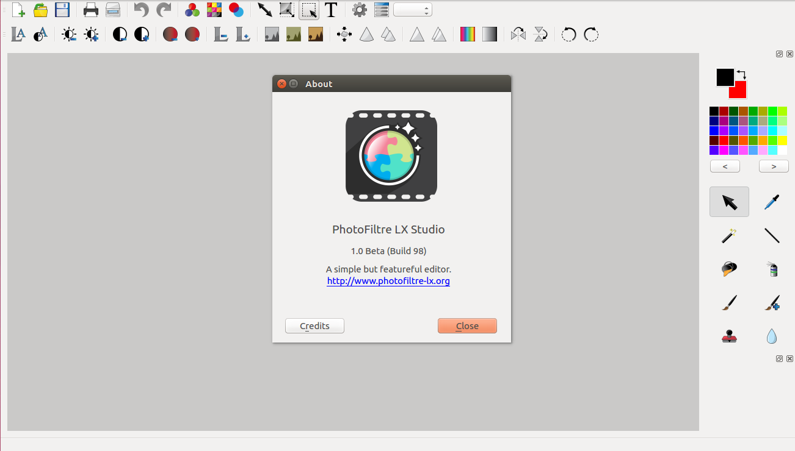

# PhotoFiltre LX

Simple but powerful Cross Platform image editor originally inspired by the PhotoFiltre image editor on Windows. Created with C++ 11, Qt Framework and the Graphicsmagick library.

## Dependencies
* libgraphicsmagick++-dev
* qt5-default (Ubuntu only)
* G++ on Linux, MinGW on Windows or Clang on MacOSX

## Building
Compile using either by opening the .pro file with Qt Creator or use qmake passing the .pro file as a parameter.
